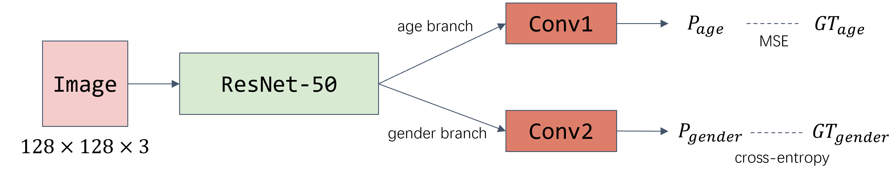
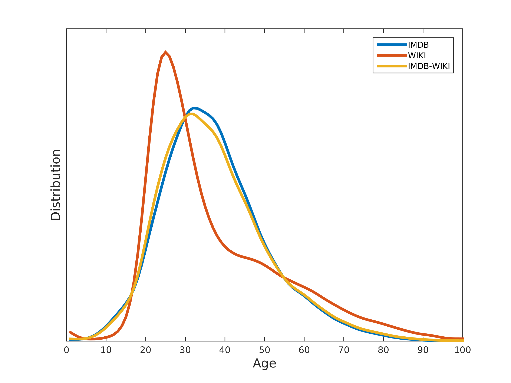
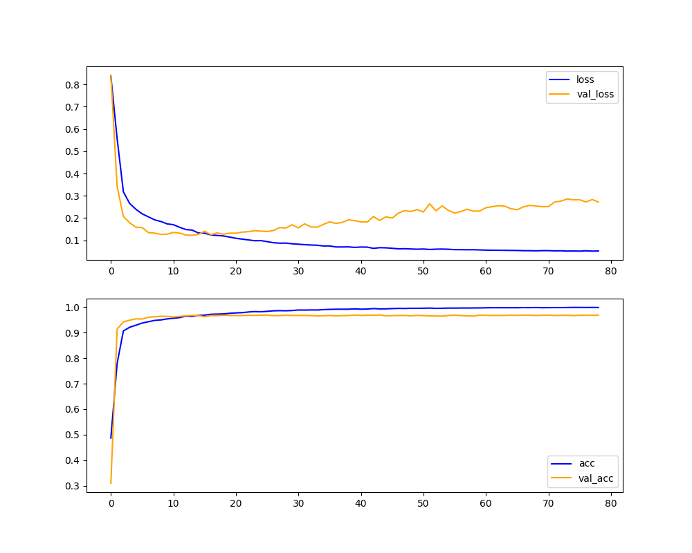
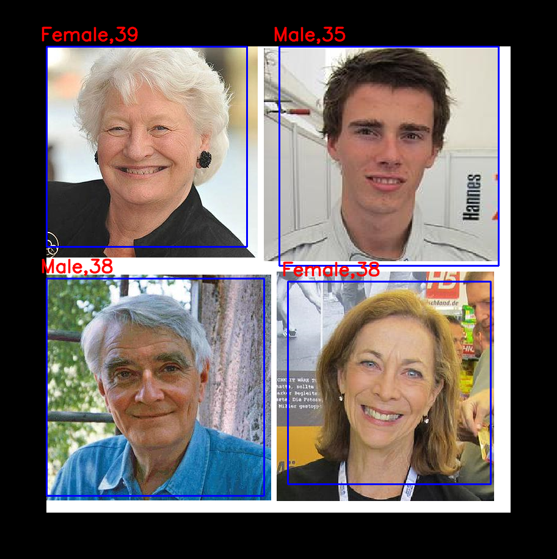

# 【Demo】基于CNN实现对人脸的性别和年龄预测（2023.10.10 更新）

### 更新说明 2023.10.10
1. 特征提取主干由 ResNet50 替换为 Swin-Small, 性别和年龄预测分支由少量卷积替换为 MLP
2. 性别预测比较准确, 年龄预测误差较大, 原因及解决思路下面单独说明
3. 更新了 README 中的说明
3. 权重文件欢迎移步 <a href="https://github.com/NICE-FUTURE/predict-gender-and-age-from-camera/releases/">Release</a> 页面下载

### 更新说明 2022.04.07

1. 深度学习框架由 Keras 替换为 PyTorch 
2. 模型结构由少量的卷积层替换为成熟的 ResNet 作为主干，并将年龄预测和性别预测统一到一个模型中，采用双分支输出结构。
3. 目前在验证集的性别预测准确率为 91%
4. 实际体验差强人意，但与去年 5 月份的试水版本相比，效果会更好
5. ~~【2022.4.22】模型权重已上传 click to download ，玩得愉快\~~~
6. 【2022.4.29】删除了代码仓库中的权重文件，如有需要，欢迎移步 <a href="https://github.com/NICE-FUTURE/predict-gender-and-age-from-camera/releases/">Release</a> 页面下载~

### 如何使用

- 训练, 离线评估, 在线推理 相关命令见 `./scripts/` 目录下的脚本
- 使用的 IMDB-WIKI(wiki_crop.tar) 数据集可<a href="https://data.vision.ee.ethz.ch/cvl/rrothe/imdb-wiki/static/wiki_crop.tar">由此下载</a>; 该链接指向的数据集文件已经是 IMDB-WIKI 数据集团队官方按照人脸区域裁剪过的了, 因此不需要进一步裁剪, 详细说明可移步<a href="https://data.vision.ee.ethz.ch/cvl/rrothe/imdb-wiki/">数据集主页</a>
- 安装所需的第三方库 `pip install -r requirements.txt -i https://pypi.tuna.tsinghua.edu.cn/simple` 
- 将 wiki_crop.tar 解压到任意目录下, 然后使用脚本 `./preprocess/prepare_dataset.py` 来准备训练所需的相关文件

### 模型结构

- 性别预测分支使用交叉熵损失函数
- 年龄预测分支使用均方差损失函数
- 模型使用 timm 库实现 ([https://github.com/huggingface/pytorch-image-models](https://github.com/huggingface/pytorch-image-models))

**注: ResNet-50 已替换为 Swin-Small, Conv1 和 Conv2 已替换为 MLP. 训练加载了 timm库 提供的 ImageNet-21k 预训练权重**

### 关于年龄预测误差过大的说明

由于使用了**完整的原始的 wiki_crop 数据集**, 而从数据集主页可见下图:

</img>

该图曲线说明数据集中图片主体的**年龄集中在 30 岁左右** (数据不均衡), 所以训练的模型 (更何况存在过拟合的模型) 会倾向于将年龄预测为该时间段。

**解决思路为:** 将年龄模型和性别模型分开，训练年龄模型时：对 30 岁左右的样本欠采样, 对剩余年龄段过采样

### 模型效果

训练过程的记录, 从曲线上可以发现模型训练到后面显然已经过拟合了 :), 不过由于使用的权重保存策略是 val_loss 最低点, 所以无伤大雅 (不想重新训练一遍了)

</img>

这是对一张组合图像的处理结果（组合的四张图片选自 IMDB-WIKI 数据集的原始图像）

</img>

<a id="sample.mp4" href="./samples/sample.mp4">测试视频</a> 剪辑自: [https://www.di.ens.fr/~laptev/download/drinking.avi](https://www.di.ens.fr/~laptev/download/drinking.avi)
